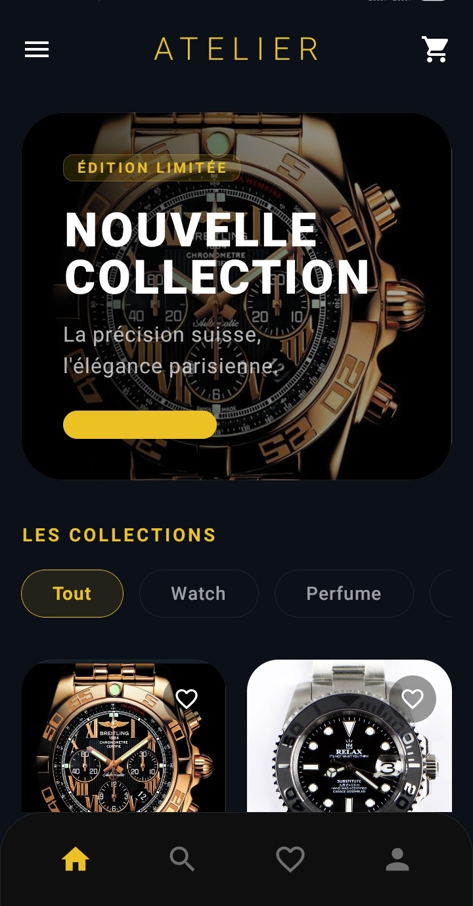
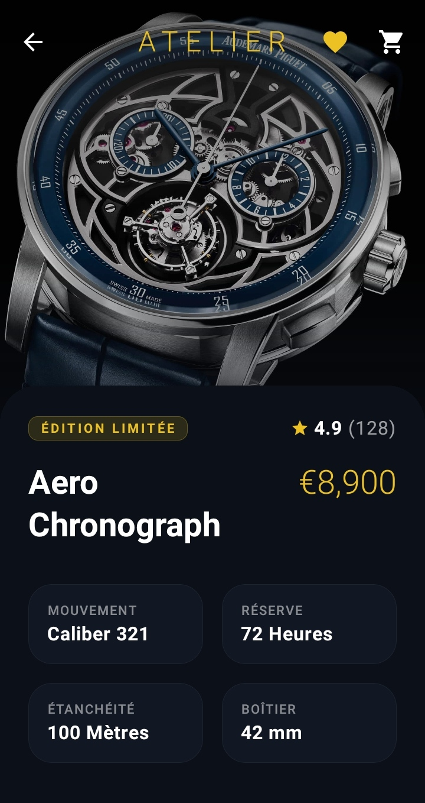
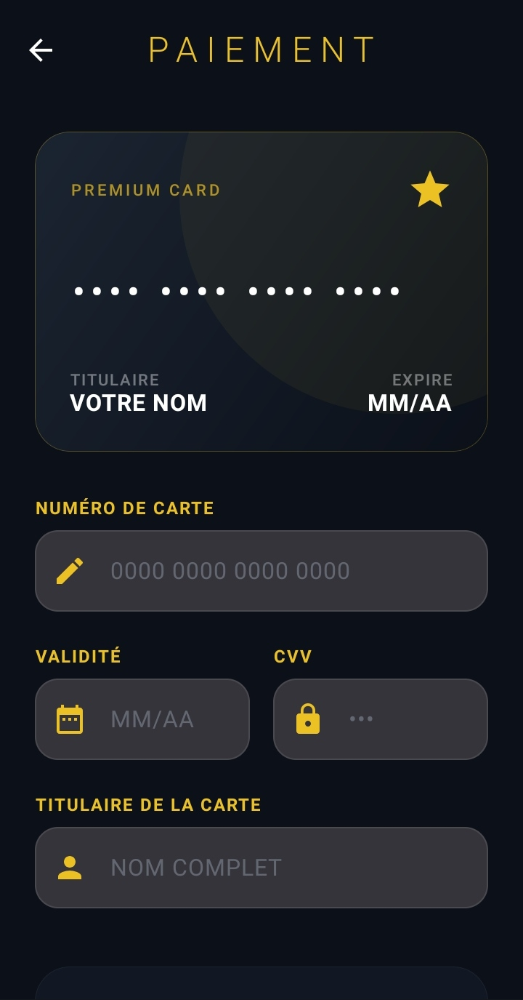

<div align="center">

  
# Atelier - Luxury E-commerce App
### *Where Precision Meets Artistry*

[](https://kotlinlang.org)
[](https://developer.android.com/jetpack/compose)
[](https://android.com)
[](https://developer.android.com/topic/architecture)
[](https://developer.android.com/training/data-storage/room)

> **A premium Android e-commerce experience** crafted for connoisseurs of luxury watches & artisan fragrances.  
> Inspired by Parisian ateliers — where every detail is intentional.

</div>

---

## 📸 App Showcase

<div align="center">

| 🏠 Landing | 📝 Register | 🛍️ Collection |
|:---:|:---:|:---:|
|  |  |  |
| **Accueil – Précision & Luxe** | **Création de compte** | **Nouvelle Collection** |

| ⌚ Product | 💳 Payment | 👤 Profile |
|:---:|:---:|:---:|
|  |  |  |
| **Fiche produit – Aero Chronograph** | **Paiement – Informations carte** | **Mon compte** |

</div>

---

## 💎 About Atelier

**Atelier** is more than a shopping app — it is a **curated digital experience** that bridges the worlds of haute horlogerie and artisan perfumery. Every screen, transition, and interaction has been crafted to reflect the elegance of the products it presents.

The design philosophy draws from the aesthetics of **Parisian luxury maisons**: dark, refined, and purposefully minimal — letting the products take center stage.

---

## ✨ Features

### 🔐 Secure Authentication
- Validated login & registration with real-time field checks
- Smooth navigation flow with no accidental bypasses
- Persistent session management via Room Database

### 🛍️ Curated Shopping Experience
- **Staggered Grid Gallery** for elegant product browsing
- **Category Filtering** — toggle between Watches & Fragrances
- **Parallax Product Pages** with detailed technical specs
- Immersive full-screen imagery for every piece

### 🛒 Cart & Wishlist
- Interactive cart with quantity controls & live price summary
- **"Saved Pieces"** wishlist — curate your personal collection
- Smooth add/remove animations throughout

### 💳 Seamless Checkout
- Premium payment screen with card information entry
- Clean, distraction-free payment flow

### 🔍 Smart Discovery
- **Live Search** with real-time filtering
- Category-aware results for watches and fragrances

### 👤 Profile Management
- Personal account overview
- Order history & preferences

---

## 🛠️ Tech Stack

```
📦 Atelier
├── 🟣 Language        →  Kotlin (100%)
├── 🎨 UI Toolkit      →  Jetpack Compose
├── 🗄️ Database        →  Room (local persistence)
├── 🏗️ Architecture    →  MVVM (Model-View-ViewModel)
├── 🖼️ Image Handling  →  Custom dynamic resource resolution
└── 🧭 Navigation      →  Jetpack Navigation Compose
```

| Technology | Purpose |
|:---|:---|
| **Kotlin** | Primary language |
| **Jetpack Compose** | Declarative, state-driven UI |
| **Room Database** | Cart, favorites & user persistence |
| **MVVM Pattern** | Clean, testable architecture |
| **ViewModel** | UI state management |
| **StateFlow** | Reactive data streams |

---

## 🎨 Design System

```
🎨 Design Philosophy
├── 🌑 Dark Mode Aesthetic    →  Deep neutral backgrounds
├── 🪟 Glassmorphism          →  Translucent, layered UI elements  
├── ✒️ Premium Typography     →  High-contrast elegant fonts
└── 📐 Staggered Layouts      →  Dynamic, editorial-style grids
```

---

## 📁 Project Structure

```
app/src/main/java/com/example/myapp/
│
├── 📂 data/
│   ├── AppDatabase.kt          # Room database setup
│   ├── CartDao.kt              # Cart data access
│   ├── CartItem.kt             # Cart entity
│   ├── Product.kt              # Product entity
│   ├── ProductDao.kt           # Product data access
│   ├── Repository.kt           # Single source of truth
│   ├── User.kt                 # User entity
│   └── UserDao.kt              # User data access
│
├── 📂 ui/
│   ├── 📂 screens/
│   │   ├── LandingScreen.kt    # 🏠 Landing & splash
│   │   ├── LoginScreen.kt      # 🔐 Authentication
│   │   ├── RegisterScreen.kt   # 📝 Account creation
│   │   ├── HomeScreen.kt       # 🛍️ Product gallery
│   │   ├── ProductDetailScreen.kt  # ⌚ Product detail
│   │   ├── CartScreen.kt       # 🛒 Shopping cart
│   │   ├── FavoritesScreen.kt  # ❤️ Saved pieces
│   │   ├── SearchScreen.kt     # 🔍 Live search
│   │   ├── PaymentScreen.kt    # 💳 Checkout
│   │   └── ProfileScreen.kt    # 👤 User profile
│   │
│   ├── 📂 components/
│   │   └── AtelierComponents.kt    # Reusable UI components
│   │
│   ├── 📂 theme/
│   │   ├── Color.kt            # Color palette
│   │   ├── Theme.kt            # App theme
│   │   └── Type.kt             # Typography
│   │
│   ├── AppNavigation.kt        # Navigation graph
│   ├── AuthViewModel.kt        # Auth state management
│   ├── CartViewModel.kt        # Cart state management
│   ├── ProductViewModel.kt     # Product state management
│   └── ViewModelFactory.kt     # ViewModel instantiation
│
└── MainActivity.kt             # Entry point
```

---

## 🚀 Getting Started

### Prerequisites
- Android Studio **Hedgehog** or later
- Android SDK **API 26+**
- Kotlin **1.9+**

### Installation

```bash
# 1. Clone the repository
git clone https://github.com/OUABEN/Atelier-Luxury-E-commerce-App.git

# 2. Open in Android Studio
# File → Open → Select the cloned folder

# 3. Let Gradle sync automatically

# 4. Run on emulator or physical device
# Run → Run 'app'  (Shift + F10)
```

### Firebase Setup *(optional)*
```bash
# 1. Create a project on Firebase Console
# 2. Download google-services.json
# 3. Place it in /app directory
# 4. Rebuild the project
```
> See `app/google-services.example.json` for the required structure.

---

## 📱 Compatibility

| Property | Value |
|:---|:---|
| Min SDK | API 26 (Android 8.0) |
| Target SDK | API 34 (Android 14) |
| Architecture | ARM64, x86_64 |
| Screen sizes | Phone & Tablet |

---

## 🗺️ Roadmap

- [ ] 🌐 Backend API integration
- [ ] 💬 Product reviews & ratings
- [ ] 🔔 Push notifications
- [ ] 🌍 Multi-language support (FR / EN / AR)
- [ ] 📦 Order tracking system
- [ ] 🎁 Loyalty & rewards program

---

## 👨‍💻 Author

<div align="center">

**OUABEN**

[](https://github.com/OUABEN)

*Crafted with precision. Designed with passion.*

</div>


---

<div align="center">

**✦ ATELIER — Precision & Luxury, Redefined ✦**

*Every great collection begins with a single piece.*

</div>
